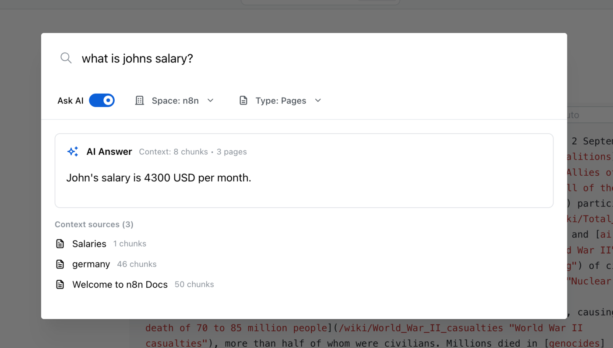
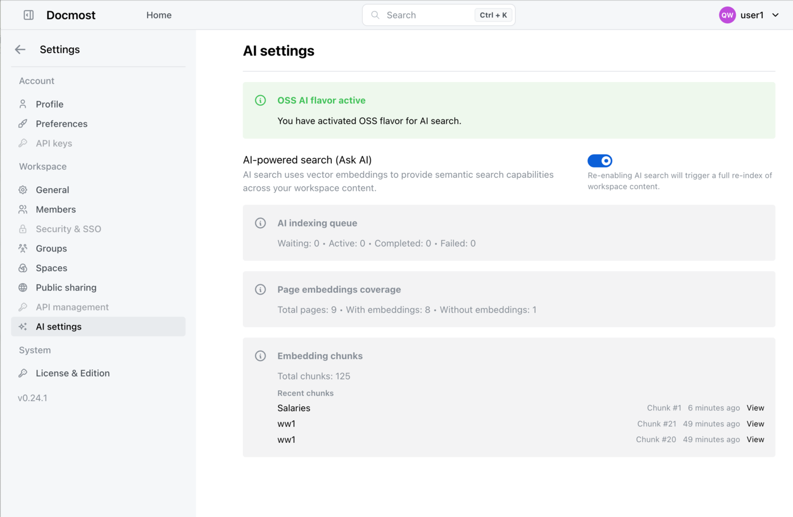

## Docmost Fork with Open Source AI implementation

This is an open-source version of Docmost with AI capabilities powered by OpenAI and OpenAI-compatible APIs. You can use it with OpenAI or self-hosted alternatives that implement the OpenAI API specification. Please note this is experimental alpha!

### Required Environment Variables

To enable AI features, configure the following environment variables:

```bash
OPENAI_API_KEY=sk-proj-xxx
AI_DRIVER=openai
AI_MODULE_FLAVOR=oss
AI_EMBEDDING_MODEL=text-embedding-3-small
AI_EMBEDDING_DIMENSION=1536
AI_COMPLETION_MODEL=gpt-5-mini
```

- `OPENAI_API_KEY` - Your OpenAI API key or compatible API key
- `AI_DRIVER` - Set to `openai` for OpenAI-compatible APIs
- `AI_MODULE_FLAVOR` - Set to `oss` for the open-source version
- `AI_EMBEDDING_MODEL` - The embedding model to use (e.g., `text-embedding-3-small`)
- `AI_EMBEDDING_DIMENSION` - The dimension of the embedding vectors (e.g., `1536`)
- `AI_COMPLETION_MODEL` - The completion model for AI-assisted features (e.g., `gpt-5-mini`)

### AI Features Screenshots

**AI Settings Page**
<p align="center">

</p>

**AI-Powered Search (Ask AI)**
<p align="center">

</p>

The AI search uses vector embeddings to provide semantic search across your workspace content, with space-level filtering support.

---

<div align="center">
    <h1><b>Docmost</b></h1>
    <p>
        Open-source collaborative wiki and documentation software.
        <br />
        <a href="https://docmost.com"><strong>Website</strong></a> |
        <a href="https://docmost.com/docs"><strong>Documentation</strong></a> |
        <a href="https://twitter.com/DocmostHQ"><strong>Twitter / X</strong></a>
    </p>
</div>
<br />


## Getting started

To get started with Docmost, please refer to our [documentation](https://docmost.com/docs) or try our [cloud version](https://docmost.com/pricing) .

## Features

- Real-time collaboration
- Diagrams (Draw.io, Excalidraw and Mermaid)
- Spaces
- Permissions management
- Groups
- Comments
- Page history
- Search
- File attachments
- Embeds (Airtable, Loom, Miro and more)
- Translations (10+ languages)

### Screenshots

<p align="center">


</p>

### License
Docmost core is licensed under the open-source AGPL 3.0 license.  
Enterprise features are available under an enterprise license (Enterprise Edition).  

All files in the following directories are licensed under the Docmost Enterprise license defined in `packages/ee/License`.
  - apps/server/src/ee
  - apps/client/src/ee
  - packages/ee

### Contributing

See the [development documentation](https://docmost.com/docs/self-hosting/development)

## Thanks
Special thanks to;


[Crowdin](https://crowdin.com/) for providing access to their localization platform.


[Algolia](https://www.algolia.com/) for providing full-text search to the docs.

